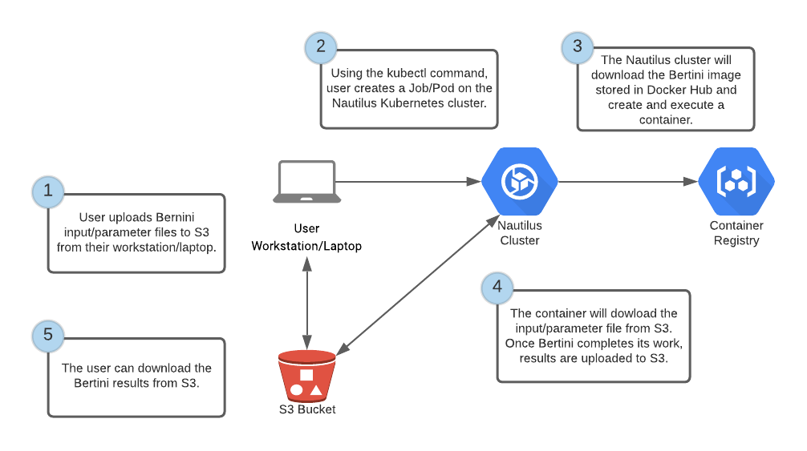

# Background

This repo contains the files necessary to build a [Docker container](https://hub.docker.com/repository/docker/mfarley/bertininautilus) used to run [Bertini](https://bertini.nd.edu/) jobs on the [PRP Nautilus](https://pacificresearchplatform.org/nautilus/) Kubernetes cluster.

It's purpose built to use an input file from S3 and move output back to the same S3 bucket/folder.

The S3 credentials are read from a Kubernetes Secret that must be created prior to creating the Kubernetes Job.

## Sample Workflow



# Building Docker Image

If you would like to build the image yourself:

```
$ docker build -t bertininautilus:latest
```

# Creating Kubernets Secrets

Using kubectl, create one secret that will hold two values that contain the S3 access and secret keys.

```
 $ kubectl create secret generic awsbertinicreds --from-literal=AWS_ACCESS_KEY_ID=xxx --from-literal=AWS_SECRET_ACCESS_KEY='xxx' -n <your namespace> 
 ```

 Check that the secret was created:

 ```
 $ kubectl get secrets -n <your namespace>
 ```

# Running Container

A sample Kubernetes job definition file is provides in the repo named bertinijob.yaml. This file will create a Kubernetes Job that will run Bertini using the specified input file.

## Modify Job
There are two things that need to be changed in this file:

Update the AWS region environment variable to match that of your S3 bucket location:

```
value: "us-west-2"
```

Update the command specifying your S3 bucket and Bertini input file name.

```
command: ["/bertini/runbertini.sh", "s3://bertini-nautilus/test2", "input"]
```

The input file can be named whatever you want; however, it should in the in the S3 bucket. 

You will also want to modify the resource limits and requests to meet you CPU and memory needs. 

## Create and Run Job

To create the job, run the following command:

```
$ kubectl create -f bertinijob.yaml -n <your namespace>
```

This command will create a pod and job and execute the runbertini.sh script in the container.

### Check Status

Use the following commands to view the status of the job and pod:

```
$ kubectl get jobs -n <your namespace> 
$ kubectl get pods -n <your namespace>
```

To pull more detailed information, use the pod name from the output above:

```
$ kubectl logs bertini-job-n99jk -n <your namespace>
```

The get jobs command has a column for COMPLETIONS. When the job completes it should show 1/1. At this point all output files generated by Bertini should be located in the specified S3 bucket.

## Cleanup

To remove the job and pod, run the following command:

```
$ kubectl delete -f bertinijob.yaml -n <your namespace>
```
